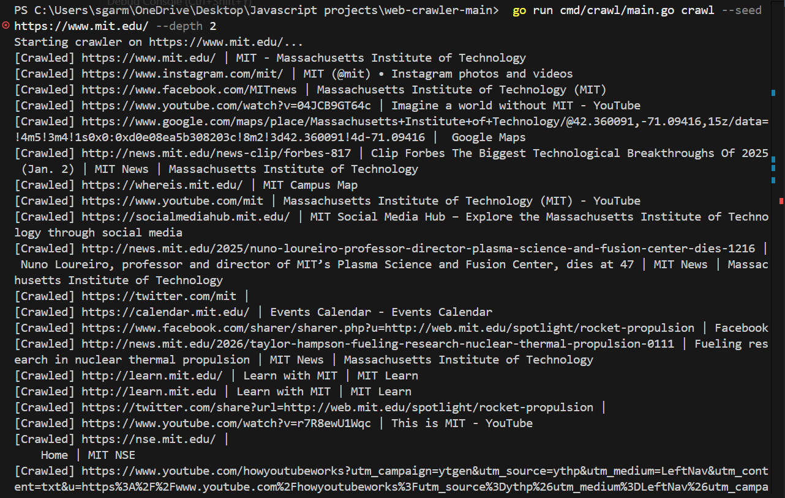

# Go Concurrent Web Crawler & Search Engine

A high-performance, concurrent web crawler and in-memory search engine built in Go. This project demonstrates advanced concurrency, MongoDB persistence, and full-stack development.




## Features

- **Concurrent Crawling**: Worker pool architecture with depth-limited BFS.
- **MongoDB Persistence**: Crawled pages are stored in MongoDB.
- **In-Memory Search**: On startup, pages are loaded from MongoDB into a TF-IDF inverted index.
- **Search API**: RESTful API (`/search`) supporting keyword queries.
- **Web Frontend**: Simple HTML/JS interface to search and view snippets.
- **Rate Limiting**: Per-domain polite crawling.

## Installation

```bash
cd web-crawler
go mod tidy
```

## Configuration
Create a `.env` file in the root directory :
```bash
MONGODB_URI=mongodb+srv://<user>:<pass>@cluster.mongodb.net
PORT=8080
```

## Usage

### 1. Crawl
Starts the crawler and saves pages to MongoDB.

```bash
go run cmd/crawl/main.go crawl --seed https://example.com --depth 2
```

### 2. Search
Load pages from MongoDB, build index, and serve the API + Frontend.

```bash
go run cmd/crawl/main.go serve
```

Open [http://localhost:8080](http://localhost:8080) in your browser.

## System Overview
The system is designed as a pipeline:
`Fetcher` -> `Parser` -> `Storage` -> `Indexer` -> `API`

### 1. Concurrency Model
**Design Pattern**: Worker Pool with Fan-Out/Fan-In.
-   **Reasoning**: Unbounded goroutines can exhaust system resources. A worker pool (tunable via `MaxConcurrent`) ensures predictable resource usage.
-   **Synchronization**: `sync.WaitGroup` tracks active jobs. `sync.Mutex` protects shared data structures (Visited Set, Rate Limiter).

### 2. Rate Limiting
**Implementation**: Token Bucket / Sleeping Leaky Bucket (Per-Domain).
-   **Logic**: A `map[string]time.Time` tracks the last request time for each domain. If a worker tries to fetch `example.com` too soon, it sleeps for the remainder of the interval.
-   **Why**: Essential for ethical crawling to avoid DoS-ing target servers.

### 3. Data Persistence (MongoDB)
**Schema**:
```json
{
  "url": "https://example.com",
  "title": "Page Title",
  "snippet": "First 200 chars...",
  "content": "Full text..."
}
```
-   **Decision**: MongoDB was chosen for its schema flexibility (dealing with unstructured HTML data) and write performance.

### 4. Search Algorithm (TF-IDF)
**Inverted Index**: Maps `Term -> []DocumentID`.
**Ranking**:
-   **TF (Term Frequency)**: How often the word appears in the page.
-   **IDF (Inverse Document Frequency)**: `log(TotalPages / PagesWithTerm)`. Reduces the weight of common words ("the", "is").
-   **Score**: `TF * IDF`.
-   **Why**: Provides significantly better relevance than simple boolean matching.

### 5. API Design
RESTful design using Go's standard `net/http`.
-   Dependencyless design ensures binary portability and reduces "supply chain" risks.
-   Endpoints are stateless; index is loaded into memory on server start for <1ms query response times.
